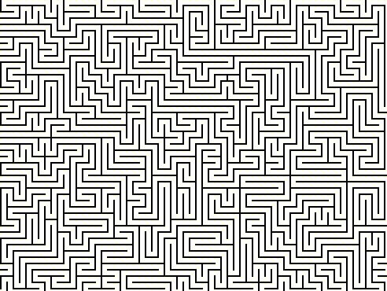
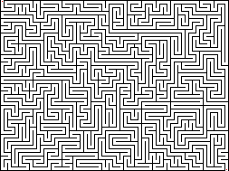
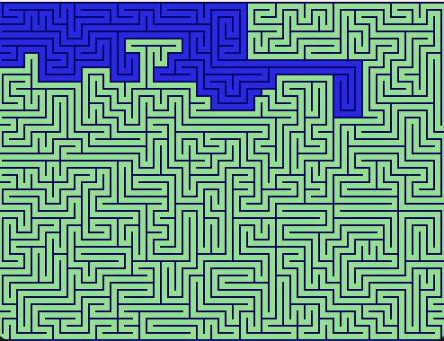

# Maze Solver 




Maze Solver is a Java program that determines whether a maze is solvable or not using the Union-Find algorithm. This repository showcases algorithmic problem-solving and Java programming.

## Table of Contents

- [Introduction](#introduction)
- [Input Files](#input-files)
- [Running the Program](#running-the-program)
- [Complex Maze Challenge](#complex-maze-challenge)
- [Project Components](#project-components)

## Introduction

Maze Solver is a program reads an input image of a maze, processes it, and checks if there is a path from the start to the end of the maze.


## Input Files

Samples of input maze images can be found in the "maze_images" folder:

1. `hard_unsolvable.PNG` - A complex unsolvable maze.
2. `hard_solvable.PNG` - A complex solvable maze.
3. `simple_unsolvable.PNG` - A simple unsolvable maze.
4. `simple_solvable.PNG` - A simple solvable maze.

## Running the Program

1. Clone this repository to your local machine:

   ```bash
   git clone https://github.com/yuvaltomer/maze-solver.git
   ```

2. Compile the Java files:

   ```bash
   javac *.java
   ```

3. Run the program with one of the input files:

   ```bash
   java Main maze_images/hard_unsolvable.PNG
   ```

   Replace `maze_images/hard_unsolvable.PNG` with the path to the input maze image you want to test.

4. The program will output either `true` or `false`, indicating whether the maze is solvable or not, and a picture of all connected components in the image.


## Complex Maze Challenge

Let's explore a complex maze challenge! Below is an image of a maze:



### Do You Think It Has a Solution?

Before running the program, take a look at the maze image above and consider whether you think it has a solution. Can you find a path from the start to the end of the maze?

### Program Result

After running the Maze Solver program on the complex maze, here's the output:



In this image, you can see the connected components of the maze. Each component is color-coded for clarity. As you can observe, the complex maze is not solvable, and the Union-Find algorithm has correctly identified the absence of a path from the start to the end.

Feel free to explore other provided maze images to see how the program handles different mazes and their connected components.


## Project Components

The Maze Solver project consists of the following main components:

1. `Main.java` - The entry point of the program responsible for reading the input maze image, processing it, and determining solvability.
2. `Maze.java` - Contains the core logic for solving the maze using the Union-Find algorithm.
3. `UnionFind.java` - Implements the Union-Find data structure, used to track the connected components of the maze.
4. `DisplayImage.java` - A utility class for handling image-related tasks, such as loading and displaying maze images.

You can explore these classes to gain a deeper understanding of the project's implementation.
